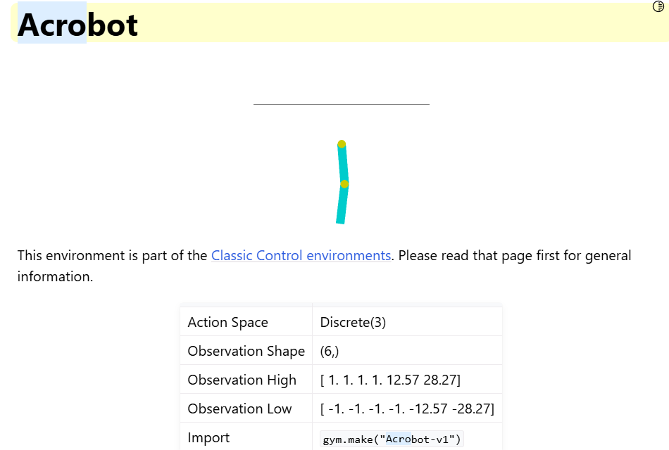
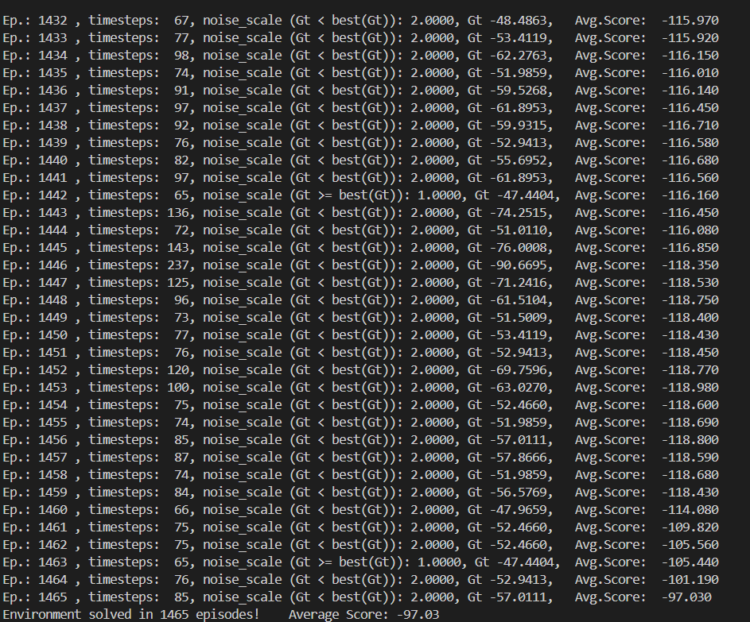

# Lab 1

[TOC]

---

## 环境配置

首先是环境的安装

首次使用conda作为包管理工具，先了解了一波conda的使用方法

配置完conda以后安装了`requirements.txt`中需要的两个包

> 最开始直接安装`gym==0.21.0`会报错，后来改成0.25.2就解决问题了

## 运行

由于最开始使用的是WSL，因此直接运行后报了一个GL库的错，问了助教哥哥才知道是WSL对GL的库的支持有一些问题

于是很快转战Windows，完成环境配置后果然跑通了

### 作业

作业是用爬山算法解决Acrobot-v1，根据提示的“只要改3行代码”，很快发现直接修改环境后会因为传参不对而报错，查询官方文档后了解到



于是把`Policy`类的初始化参数修改：

```python
class Policy():
    def __init__(self, s_size=6, a_size=3):
        self.w = 1e-4*np.random.rand(s_size, a_size)  # weights for simple linear policy: state_space x action_space
    ...
```

即可跑通


